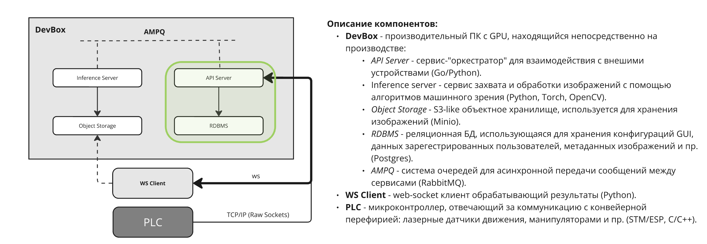

# synetra-be-challenge

## Задача
Написать два сервиса: ```api``` и ```camera```. Использовать можно ```python``` или ```go``` на ваш выбор.
Верхнеуровнего схема работы программы изображена ниже:



### Пример работы программы

    1. PLC (tcp-server) отдает команду программе, что некий объект на линии подъезжает к камере и пора делать фотографию.
    В нашем случае, работу с реальной камерой мы заменяем на изображение из папки проекта.

    2. Программа создает сущность объекта в базе данных, сохраняет изображение в объектное хранилище, и отправляет данные дальше.
    В примере это очередь inference.in (для обработки изображения), и в websocket-client (заменяет frontend).

    3. API сервис нужен, чтобы пользователь мог через frontend создавать, просматривать и изменять сущности в БД.
    В нашем случае, чтобы не плодить таблицы - все ручки написаны для сущности обрабатываемого объекта.

### api
Простой api, с 3 ручками:
- Добавление записи в бд
- Поиск записи по id
- Список всех записей
База данных ```sqlite``` находится в ```./data/sqlite/excercise.db``` и содержит следующие 4 поля:
- ```id```
- ```image_url``` (ссылка на изображение, сохраненное в minio)
- ```width``` (ширина изображения в px)
- ```height``` (высота изображения в px)

### camera

Сервис, имитирующий работу с камерой должен включать в себя:
- tcp клиент, который подключается к серверу (порт вы можете найти в ```.env```)
- websocket server
- работу с rabbitmq, minio и sqlite
При получении от tcp сервера сообщения ```[s][save_image][e]``` вы должны:
- Взять изображение из ```./data/images/```
- Сохранить его в minio
- Сохранить данные об изображении в sqlite
- Отправить сообщение, содержащее ссылку на изображение в minio, в формате json клиенту ws сервера
- Отправить такое же сообщение в rabbitmq (exchange и routing_key - ```inference.in```) 

### Docker и docker-compose

Будет большим плюсом, если вы напишете для каждого сервиса Dockerfile и добавите их в docker-compose.yaml

## Требования
- Используйте на выбор ```python``` или ```go```
- Старайтесь использовать минимум сторонних библиотек
- Проект должен быть небольшим, но структурированным 
- При взаимодействии с БД используйте SQL
- Добавить интеграционные и e2e тесты для базовых сценариев взаимодействия сервисов (см. описание выше)
- Сопроводите ваше решение небольшой секцией в ```README.md```

## Запуск

```bash
$ docker compose up -d
```

### Остановка

```bash
$ docker compose down
```

## Связь

Вы должны отправить ссылку на Ваш форк данного репозитория, на почту 
```echudinov@synetra.ru``` . Туда же пишите по любым возникшим вопросам.
Мы рассмотрим Ваше решение и в ответ пришлем результаты ревью.

## Решение

Реализованы оба сервиса (`api` и `checker`), настроена отказоустойчивая интеграция с инфраструктурными контейнерами (MinIO, RabbitMQ, SQLite) и успешно внедрены сквозные интеграционные тесты.

###  Архитектура и ключевые особенности реализации

При проектировании и написании кода фокус был сделан на максимальную производительность, автономность и строгое соблюдение требований.

1. **Многопоточный сетевой слой (`checker`)**:
   - Логика полностью адаптирована под синхронно-потоковую модель (`threading.Thread`), заложенную в шаблоне воркера репозитория.
   - **Кастомный WebSocket-сервер** и **TCP-сервер** написаны «с нуля» на базе встроенных низкоуровневых сокетов Python (`socket`). Рукопожатие (Handshake) и сборка текстовых фреймов реализованы вручную согласно спецификации **RFC 6455**. Это исключило конфликты асинхронных фреймворков внутри блокирующих системных потоков.
   
2. **Парсинг геометрии кадров без внешних библиотек**:
   - Определение разрешения изображений (`width` / `height`) для сохранения метаданных в БД реализовано через бинарный парсинг сигнатур байтов файлов формата PNG/JPEG с помощью встроенного модуля `struct`. Тяжелые и потенциально уязвимые библиотеки (например, `Pillow`) в проект **не подключались**.

3. **Отказоустойчивость брокера сообщений (Resilience & Retry Loop)**:
   - Взаимодействие с RabbitMQ переведено на явные параметры подключения `pika.ConnectionParameters` и авторизацию `PlainCredentials`.
   - Внедрен **механизм автоматических повторных попыток (Retry Loop)** с прогрессирующей задержкой при отправке сообщений. Это защищает воркер от падения и потери данных, если брокер `rabbitmq` находится в процессе долгого внутреннего прогрева базы пользователей при холодном старте Docker-контейнеров.
   - Декларация точек обмена (`exchange_declare`), очередей и биндингов продублирована на стороне Python-кода, что делает запуск сервисов независимым от внешних Docker-скриптов инициализации.

4. **Асинхронный HTTP API сервис (`api`)**:
   - Реализован на базе легковесного `aiohttp`. Предоставляет асинхронный CRUD-интерфейс к общей базе данных SQLite для чтения и записи сущностей объектов. Потокобезопасность обеспечивается за счет транзакционности SQLite при работе с Docker Volumes.

5. **Безопасность сборки (PEP 668)**:
   - Docker-образы используют изоляцию слоев и собраны на базе `python:3.11-slim`. Установка пакетов оптимизирована флагами `--no-cache-dir` и `--break-system-packages` для строгого соответствия современным стандартам безопасности сред Linux (PEP 668).

---

###  Доступные API Ручки (Порт 8000)

| Метод | Эндпоинт | Описание |
| :--- | :--- | :--- |
| **GET** | `/api/records` | Получить полный список всех обработанных объектов из SQLite. |
| **GET** | `/api/records/{id}` | Поиск конкретного объекта и его метаданных по первичному ключу ID. |
| **POST** | `/api/records` | Вручную создать и сохранить новую запись объекта в базе данных. |

---

###  Запуск интеграционного тестирования (E2E)

Для автоматической верификации базовых сценариев взаимодействия сервисов (сигнал PLC ➡️ захват кадра ➡️ хранилище ➡️ брокер ➡️ вебсокет ➡️ API) написан тест `tests/test_integration.py`.

**Инструкция по локальному запуску тестов:**

1. компиляция и запуск контейнера с логами:
   ```bash
   docker compose build --no-cache
   docker compose ps
   docker compose logs -f checker
   ```
2. установка необходимых тестовые зависимости в локальной системе:
   ```bash
   sudo apt update
   sudo apt install python3-pytest python3-pytest-asyncio python3-pytest-cov python3-aiohttp
   ```
3. запуск автоматического тестирования:
   ```bash
   pytest -c /dev/null tests/
   ```
